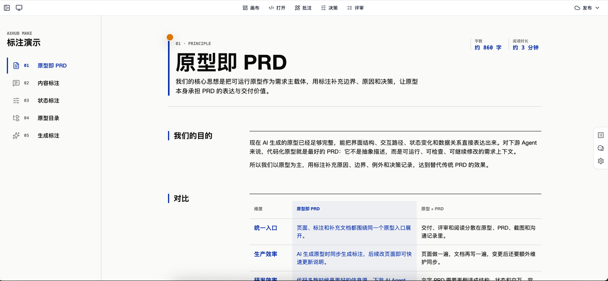
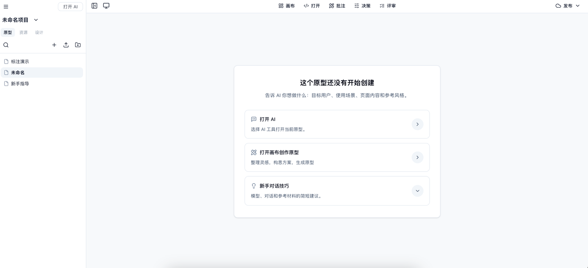
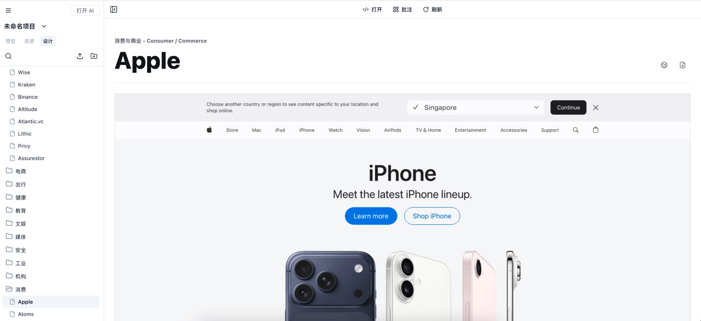

# Axhub Make

> Axhub Make 不是“又一个 AI 生成页面工具”。
> 它是一条从 **需求分析** 到 **原型生成**、**批注微调**、**原型评审**，再到 **发布交付** 的 AI 产品工作流。

给产品、设计师、业务团队和 AI Agent 用。

你说清楚要什么，Make 会把它变成：

- 可以点击、可以评审、可以发布的交互原型
- 带批注、标注和业务说明的“活 PRD”
- 基于设计系统和专业技能生成的 UI/UX 方案
- 面向新手的免费教程和上手路径
- 可分享、可导出、可交付的原型成果

官网：[https://axhub.im/make/](https://axhub.im/make/)

## 直接启动

在你的项目目录里运行：

```bash
npx -y @axhub/make@latest
```

启动后会自动打开管理页面。如果没有打开，复制终端里显示的地址到浏览器。

## 让 AI 帮你启动

把下面这段发给你的 AI Agent，让它帮你检查环境、启动 Make，并创建一个以后可以直接双击运行的桌面脚本：

```text
请帮我在当前项目目录启动 Axhub Make，并确保以后可以一键启动。

目标命令：
npx -y @axhub/make@latest

请按下面要求执行：

1. 先检查当前环境是否可以直接执行 `npx -y @axhub/make@latest`。
2. 如果命令失败，不要停在报错处。请判断原因并处理，直到这个命令可以直接执行：
   - 检查 Node.js、npm、npx 是否可用；
   - 如果缺少依赖，请按当前操作系统安装或引导我安装；
   - 如果是网络、权限、缓存、PATH、Node 版本或 npm 配置问题，请修复或给出可执行命令；
   - 每次修复后重新运行 `npx -y @axhub/make@latest` 验证。
3. 启动成功后，确认管理页面已经打开；如果没有自动打开，请把终端里的访问地址复制给我。
4. 在我的桌面创建一个启动脚本，用来以后直接启动 Axhub Make：
   - macOS/Linux：创建可双击或可执行的 `.command` 或 `.sh` 脚本；
   - Windows：创建 `.bat` 或 `.cmd` 脚本；
   - 脚本需要进入当前项目目录，然后执行 `npx -y @axhub/make@latest`。
5. 创建脚本后，请实际运行一次脚本，确认脚本可以正确启动 Axhub Make。
6. 最后告诉我：
   - Axhub Make 的访问地址；
   - 桌面脚本的完整路径；
   - 如果后续要手动启动，应该双击哪个脚本。
```

## 核心能力

| 能力 | 说明 |
| --- | --- |
| AI 原型生成 | 根据业务目标、目标用户和核心场景生成可点击、可评审的交互原型。 |
| 活 PRD | 通过批注、标注、字段说明和状态说明，把需求沉淀在真实界面上。 |
| UI/UX 工作流 | 结合设计系统和图像生成能力，支持界面生成、风格探索和 UI 还原。 |
| 设计系统 | 内置多种产品类型和视觉风格，适合快速建立专业界面方向。 |
| 专业技能 | 覆盖需求梳理、交互设计、原型生成、评审和交付等常见产品流程。 |
| 新手教程 | 提供上手路径和示例，帮助非技术用户完成第一个 AI 原型。 |
| 发布交付 | 支持在线分享、HTML 成果、Axure/Figma/HTML 等交付形态。 |

## 界面演示






